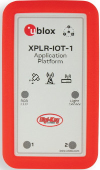
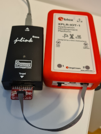
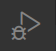
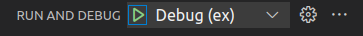

# Learning by examples

This repo is intended to be a starting point on learning how to use the u-blox open source library [ubxlib](https://github.com/u-blox/ubxlib). The intended target system here is the [XPLR-IOT-1](https://www.u-blox.com/en/product/XPLR-IOT-1) device but most of the examples are also applicable to
any u-blox module or EVK supported by ubxlib.

The main focus here is to make everything as uncomplicated as possible. The host mcu in an XPLR-IOT-1 device is the Nora-B1 with Nordic nRF5340. Unless you are familiar with the nRFConnect SDK and the Zephyr RTOS, the learning curve for mastering the development environment for this chip is quite steep. This repo tries to raise the abstraction layer and let you focus on the actual programming using ubxlib. Once started you can then dig into the more intricate parts of both ubxlib and Zephyr in your own pace.

The interface to building, running and debug software for ubxlib can be either the command line or [Microsoft Visual Studio Code](https://code.visualstudio.com/).

Both Windows (Windows 10 tested) and Debian Linux (Ubuntu 20.04 tested) are supported.

There are two ways of using this repository depending on what you have installed on your PC.

If you already have the Nordic nRFConnect SDK installed and know how to use it, you can just clone this repository and go on from there directly. If the environment is installed in the standard location it will be detected automatically.

    git clone --recursive https://github.com/u-blox/ubxlib_examples_xplr_iot

On the other hand if this is your first encounter with the Nordic nrf53 chipset and possibly also with git, a complete installation script which includes everything needed for development is provided. In this case [goto this page](install/README.md) for more information about the installation process.

You can of course also install everything yourself following the instructions at the [Nordic web site](https://www.nordicsemi.com/Products/Development-software/nrf-connect-sdk). The repository has been tested with nRF Connect versions 1.6.1 up to 2.1.0. However some of the examples do require at least version 1.9.0.

It also works if you have your own tailored installation. You just have to specify where to find the nRFConnect environment parts. More about this below.

# Requirements

To use this repo you need at least an XPLR-IOT-1 device. Please note though that this device doesn't contain any debug chip so in order to be able to do debugging you need to have some kind of debugger/programmer device. This would typically be a JLink debugger.

You also need a 10 pin programmer cable to connect the XPLR-IOT-1 and the programmer. Examples shown below:

However it is still possible to build and flash the examples into an XPLR-IOT-1 without a programmer. This is then made through a usb cable connected to the unit. No debugging is however possible in this case. Please note that this type of flashing requires the "newtmgr" program. This is installed automatically by the installation scripts of this repo, but if you have done a manual installation you have to add this manually as well and make sure it is in your path. It is available for download [from here](https://archive.apache.org/dist/mynewt/apache-mynewt-1.4.1)

Please note that the usb cable should also be inserted if you want to see printouts from the example programs.

The actual flash process is different if you have a debuger unit or are just using the serial cable. In the first case everything is done automatically if the debug is connected to the XPLR-IOT-1. In the latter case manual interaction is needed. You must first turn off the XPLR-IOT-1 with its on/off button. Then press down button 1 on the top side of the unit and keep it pressed while turning on the device again. The unit is now in bootloader mode and the flashing process can begin. Flashing performed by this repository tools will prompt you for confirmation of that the unit is in bootloader mode before starting.

**Also please note** that by flashing these examples you will overwrite the "Sensor Aggregation" firmware which is installed in a fresh XPLR-IOT-1. Should you later want to restore that firmware, [this page](https://github.com/u-blox/XPLR-IOT-1-software) will show you how.

# Getting started

Once you have everything installed and have connected your XPLR-IOT-1, you can start exploring the functionality of this repository.

Begin by starting a command window. Then change working directory to where the repository was cloned. If you have used the installation script this will be in a directory underneath your home directory named xplriot1\ubxlib_examples_xplr_iot.

Please note that if you have installed the nRFConnect SDK via the "Toolchain Manager" desktop app you may have to start the command prompt via the corresponding entry in the dropdown list. This is the case if Python is not available in your standard path.

Then issue the following command:

Windows:

    do vscode

Linux:

    ./do vscode

This will execute a complete build of the simple blink example and then start Visual Studio Code.

Once Visual Studio Code has started you will find the "main.c" source code in a window.

From within Visual Studio Code you can then build, rebuild, flash and run the examples. This is done via selecting the menus *Terminal -> Run Build Task* or by pressing the shortcut *ctrl-shift-b*. Choose *Build and run "blink"* to flash and start the blink example and the red led of your XPLR-IOT-1 should start blinking.

You can then select any of the other examples by choosing *Select Example* in the Build Task menu as above. After that you can select *Build and run* again.

If you have a debug unit you can then also start a debugging session by first selecting the *Run and debug* icon in the left side pane.

Then select the green arrow in the top section and a debugging session will start.

The program will stop at the first line in the program. Experiment with the different debug functions in Visual Studio Code such as stepping, checking variables etc.

You can then start modifying the examples to you liking or add your own, more about that further down.

# Advanced usage

All the operations performed in this repo are controlled by one central command named "do". This command is executed as described above in a command window with the default directory set to the root of the repo.

Below is the help information for the command as shown when issuing "do --help". More thorough description below.

    usage: do [-h] [-e EXAMPLE] [-p] [--no-bootloader] [--when-changed] [-d BUILD_DIR]
            [-n NCS_DIR] [-t GCC_DIR] [-u UBXLIB_DIR]
            operation [operation ...]

    positional arguments:
    operation             Operation to be performed: vscode, build, flash, run, monitor, debug

    optional arguments:
    -h, --help            show this help message and exit
    -e EXAMPLE, --example EXAMPLE
                            Name of the example
    -p, --pristine        Pristine build (rebuild)
    --no-bootloader       Don't use the bootloader
    --when-changed        Only flash when build was triggered
    -d BUILD_DIR, --build-dir BUILD_DIR
                            Root directory for the build output
    -n NCS_DIR, --ncs-dir NCS_DIR
                            Nrf connect sdk installation directory
    -t GCC_DIR, --gcc-dir GCC_DIR
                            GCC toolchain installation directory
    -u UBXLIB_DIR, --ubxlib-dir UBXLIB_DIR
                            Ubxlib directory

The most typical operations are:

| Operation      | Description |
| ----------- | ----------- |
| **build**  | Will perform a build of the selected example. Corresponding to "west build" |
| **vscode**  | First do a build and then start Visual Studio Code |
| **flash**  | Build and then flash the XPLR-IOT-1|
| **monitor**  | Start a serial port viewer/input in the current terminal|
| **run**  | A combined build-flash-monitor operation |
| **debug**  | Starts command line debugging using gdb |

These operations can also be started from within Visual Studio Code as described above.

There are some options for the operations which can be specified. These can be temporary for the actual command or be saved as new defaults. In the latter case the operation "save" is used.

The --example option is used to specify which example to build. If not specified the example used in latest previous run will be used. See the directory structure underneath the examples subdirectory for the names available. Example:

    do build -e socket

There will be a automatic search for examples among the directories so if you add your own that will be included as well in the list of choosables.

### Directory specification

There are some directories which are needed to be defined for the build process. These have default values depending on how the installation is made but can always be overridden by the options below:

| Option      | Description |
| ----------- | ----------- |
| **--ncs-dir**  | The root directory for the nRF Connect SDK installation. If the default location (C:\ncs \| ~/ncs) is used the latest version will be found automatically and used. If another location should be used it can be specified here.|
| **--gcc-dir**  | The directory for the GCC ARM compiler. If a default installation of nRFConnect is found as above the one here will be used. If another location should be used it can be specified here.|
| **--build-dir**  | By default all produced files from the build will be placed in a subdirectory named "-build". Use this option to place it elsewhere.|
| **--ubxlib-dir**  | By default the ubxlib version used is the one which is included as a submodule to this repo. This is possible to override with this option.|

### Other options

| Option      | Description |
| ----------- | ----------- |
| **--pristine**  | Force a complete rebuild|
| **--when-changed**  | Only flash when a build was triggered|

## The config directory ##

This directory contains the specifics for handling the XPLR-IOT-1 in Zephyr.

The files here are mainly overlay files used to override the specific settings for XPLR-IOT-1 when using the nrf5340dk board files.

Here is also a c-file for defining the default gpio pins etc and setting them to enable the different u-blox modules automatically from ubxlib.

There are some cmake variables you can define for controlling these files.

| Variable      | Description |
| ----------- | ----------- |
| NO_SENSORS | When set i2c is not included in the build and this enables the use of all 4 uarts. This means that both the Nina W15 and the Sara R5 modules can be used at the same time |
| EXT_FS | Enables use of a file system on the external SPI-flash memory. Used in the "filesystem" example|
| NO_DEBUG | By default debug optimization is used for compilation. Set this variable to disable that|

### Bootloader

By default the mcuboot bootloader which is available in a fresh XPLR-IOT-1 will be kept. If you don't want that then use the option:

    --no-bootloader

Should you later want to change this you can use the operation "flash_bootloader"

### Network cpu

The network cpu of the host nrf5340 is not used in most of the examples. However if the Bluetooth functionality is to be used in the host (and not in the Nina module), a firmware for the network cpu has to be built and flashed. The build is done automatically whenever the KConfig setting CONFIG_BT is set.

To flash the built network cpu firmware the following command must be used after a successful build of the example:

    do flash_net

This is only required to be done once.

Please note that this command will only work for examples that has defined CONFIG_BT. The current examples doing that are: ibeacon, scanner and aoa_tag. In this case the command will be for ibeacon:

    do flash_net -e ibeacon

