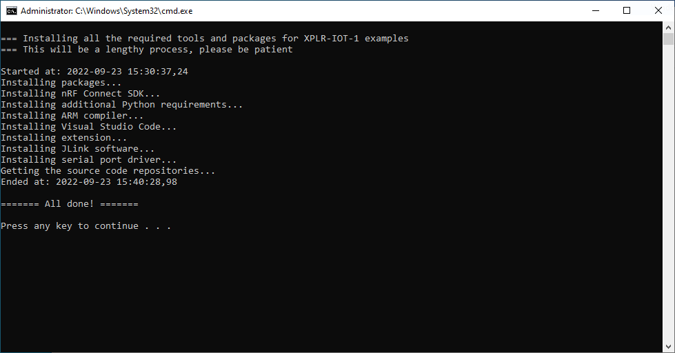

# Installation

This directory contains the operating system specific installation scripts for the development tools required to build the XPLR-IOT-1 examples.

These scripts installs all the necessary packages, tools and drivers from scratch. They can typically be used on a PC that has not been used for software development before or one with missing components.

The scripts will also install git and clone the actual repository.

## Windows

[Click this link](https://github.com/u-blox/ubxlib_examples_xplr_iot/raw/master/install/install_windows.bat) and then chose "Save as" in the browser to download the installation script for Windows. Please note that depending on which browser you are using there may be an additional *.txt* extension added to the *.bat* file name. In that case remove the *.txt* extension.

When the download is complete you also need to unblock the security option which is applied by default to a files downloaded from the network. Right click on the file in the Windows Explorer, select *Properties* in the menu and then check the *Unblock* option.

Once all this has been done then right click on the file again and select *Run as administrator*. The installation will then start and it is quite a lengthy process, typically ~10 min.

**Please avoid** clicking in the window of this operation if you have *Quick Edit* for command windows enabled. Doing so may halt the downloading process which in turn can lead to timeouts and later problems for the installation.

The [chocolatey](https://chocolatey.org/) package manager is used for installing the required tools. Python 3 will be installed from the standard Python installation repository. The required drivers for the XPLR-IOT-1 serial ports will also be installed.

The examples repository is installed in a sub directory to your home directory named *xplriot1\ubxlib_examples_xplr_iot*. Start a command prompt and change working directory to this and then you can start the operations described on the [main README page](https://github.com/u-blox/ubxlib_examples_xplr_iot).

## Linux

[Click this link](https://github.com/u-blox/ubxlib_examples_xplr_iot/raw/master/install/install_linux) and then chose "Save as" in the browser to download the installation script for Debian Linux. Once downloaded just run it. It will require sudo access as new packages will be installed. The installation will take some time so please be patient.

When the installation has completed you should either log out and in again or run "source ~/.profile before doing any further operations related to this repository.

The examples repository is installed in a sub directory to your home directory named *~/xplriot1/ubxlib_examples_xplr_iot*. Start a command prompt and change working directory to this and then you can start the operations described in the [main README page](https://github.com/u-blox/ubxlib_examples_xplr_iot).
